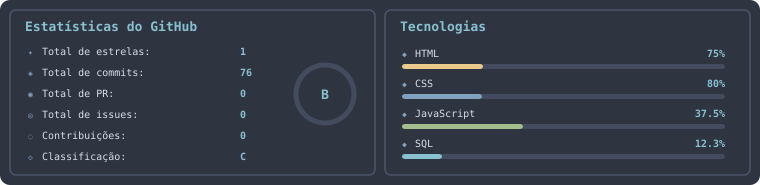

  <!-- BANNER / IMAGEM ESPECÍFICA -->
  

    

  <!-- REDES SOCIAIS -->
  
  
  

 

---

  

---

### **SYSTEM STATUS: ABOUT ME**

<table>
  <tr>
    <td width="50%" valign="top">
      <h4>Português 🇧🇷</h4>
      <pre><code>const developer = {
    nome: "Bios1480",
    funcao: "Desenvolvedor Full Stack",
    localizacao: "Brasil",
    diretrizes: [
        "Transformar café em código otimizado",
        "Construir arquiteturas escaláveis",
        "Explorar IA, Web3 e Cyber-Security"
    ],
    status: "Disponível para novos projetos"
};</code></pre>
    </td>
    <td width="50%" valign="top">
      <h4>English 🇺🇸</h4>
      <pre><code>const developer = {
    name: "Bios1480",
    role: "Full Stack Developer",
    location: "Brazil",
    directives: [
        "Turn coffee into optimized code",
        "Build scalable architectures",
        "Explore AI, Web3 & Cyber-Security"
    ],
    status: "Available for new projects"
};</code></pre>
    </td>
  </tr>
</table>

---
